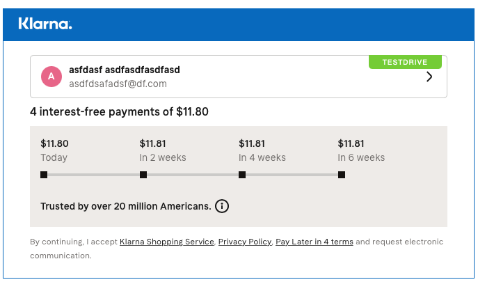
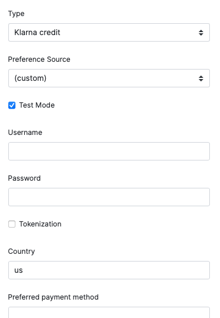
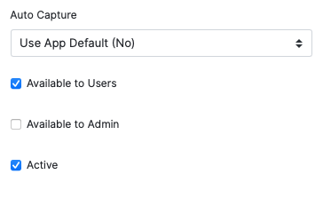

# Klarna Payments Integration for Solidus


This integration enables [Solidus](https://solidus.io) to provide [Klarna](https://www.klarna.com/) Payments as a payment option.



*The example screen shot above shows a sample US Klarna Payments offer. Klarna Payments offers are specific to each market and merchant. Work with Klarna to determine what offers are appropriate for your store.*

### Features

- Integrates seamlessly as a payment provider
- Supports auto capture
- Supports partial captures, refunds, and partial refunds
- Configurable design
- [ActiveMerchant](http://activemerchant.org) interface for Klarna Payments

### Limitations

- *Multiple* captures for one authorization are currently *not* supported because of Solidus' process when capturing payments. This might change in future versions of Solidus and this gem respectively. However, it is possible to use the MyKlarna portal to do that.
- Changing customer data after they completed the order is not synced to the Klarna API. So please be aware that you have to change the information in the MyKlarna portal if needed.
- A customer is able to choose multiple payment options for an order.  If an order does have multiple payment options, you should capture the most recent payment choice first, which be listed at the bottom of the list of payments.
- It’s important to cancel Klarna payments if the customer paid with another payment method in the end after receiving a successful Klarna authorization, we can not send `release_remaining_amount` to Klarna  in this case and the users credit limit would still be blocked.


### Supported Solidus Versions

- Solidus 1.3.x
- Solidus 1.4.x

Work is planned for compatibility with the 2.x branch of Solidus.

## Installation (beta)

This gem is currently in **a public beta phase**.  For the time being it will only be installable via git:

```ruby
gem 'klarna_client', github: 'bitspire/klarna_client'
gem 'solidus_klarna_payments', require: 'klarna_gateway', github: 'bitspire/solidus_klarna_payments'
```

And then execute:

    $ bundle

In your project include the migrations, JavaScript and stylesheets:

    $ rails generate klarna_gateway:install

Please note that the version is still 0.9. We want to have the option to make breaking changes during the transition to 1.0.

## Solidus configuration

After the installation, create a new payment method and select `Spree::Gateway::KlarnaCredit` as the gateway. After saving the payment method, you can configure your Klarna credentials and set design options for how Klarna is displayed to the customer in the checkout.



The "country" option is mandatory and refers to the region the account is associated with. In the example above it's `us` for the USA, other values would be `uk` for the United Kingdom and `de` for Germany.

There are two other things to configure. Set the payment method to "active" and only enable it in the frontend. Some payment methods can be used in the backend by the merchant. As this is not appropriate for Klarna Payments, it should be disabled. You can also configure to automatically capture the payments when the customer confirms their order.



*Note*: After you ran `klarna_gateway:install` the initializer in `config/initializers/klarna_gateway.rb` allows some configuration. It's usually not necessary to touch the file unless you're sure what you're doing.


## Technical information

The integration adds the necessary code to the checkout. It consists of mainly of three parts:

- [a template](app/views/spree/checkout/payment/_klarna_credit.html.erb) to display the iframe when Klarna is selected as the payment method
- a JavaScript library/jQuery plugin to handle sessions and authorisation
- a CSS file with very little code to display the iframe correctly

The template can be overwritten by copying [the file](app/views/spree/checkout/payment/_klarna_credit.html.erb) to `app/views/spree/checkout/payment/_klarna_credit.html.erb` in the main application. Note the initialisation JS code which is required for the integration to work.

### JavaScript library

The JavaScript library is used to initialize a session with Klarna, authorize the requested amount and handing the obtained _authorization token_ to Solidus. This token is later used when authorizing the payment in Solidus.

If the checkout (template) was modified, it can be necessary to adapt the integration as well. The `KlarnaGateway` library was extracted to make that easier. It is initialized as follows:

```javascript
KlarnaGateway.loadSdk(this, document, function() {
  jQuery(".klarna_credit_box").klarnaAuthorize();
});
```

`loadSdk` will load the Klarna JavaScript SDK from the CDN and call the provided callback function when the file was loaded. Note that it's also possible to do that manually by including the file with a `<script>` tag. Please see the [JavaScript SDK](https://credit.klarnacdn.net/lib/v1/index.html) documentation for more details.

The initialization is done in `klarnaAuthorize()` on the payment step page in the checkout. It will create a session with Klarna and load the iframe when Klarna is selected by the user. It is called on the container (`.klarna_credit_box` in this case) in which the iframe will be inserted.

To make customizations easier `klarnaAuthorize()` takes some optional arguments. Here they are with their defaults:

```javascript
$(container).klarnaAuthorize({
  // Element that stores the authorization token. This will usually be a hidden input
  // field for the payment source.
  authorizationToken: $("#klarna_authorization_token", this),

  // The form that is submitted on the payment page. The submit event is prevented so
  // the payment can be authorized before progressing any further.
  form: $("#checkout_form_payment"),

  // Elements that trigger a check whether Klarna is selected. The iframe is only loaded
  // when Klarna is selected
  paymentChangedElements: $("input[name=\"order[payments_attributes][][payment_method_id]\"]"),

  // Where to find the payment method id. This is necessary if there are more than one Klarna
  // payment methods in the store.
  paymentId: $(this).data("payment-method-id"),

  // The session URL of the store. The store needs to create a session from the server
  // side. This should not be changed.
  sessionUrl: Spree.url(Spree.pathFor("/klarna/session")),

  // The submit button that triggers the authorization. This button will be disabled while
  // the autorization is issued.
  submitButton: $("form.edit_order :submit")
})
```


### Klarna API documentation

- [Klarna's API](https://developers.klarna.com/api/) is used by the payment gateway
- [Javascript SDK](https://credit.klarnacdn.net/lib/v1/index.html) for the frontend part

For more information see [Klarna's Developers Portal](https://developers.klarna.com/).

## Contributing

Contributions are always welcome. If you find a bug or have a suggestion, please open a ticket on Github. If you want to contribute code directly, just open a pull request and describe your change.

1. Fork it
2. Create your feature branch (`git checkout -b my-new-feature`)
3. Commit your changes (`git commit -am 'Add some feature'`)
4. Push to the branch (`git push origin my-new-feature`)
5. Create new Pull Request
